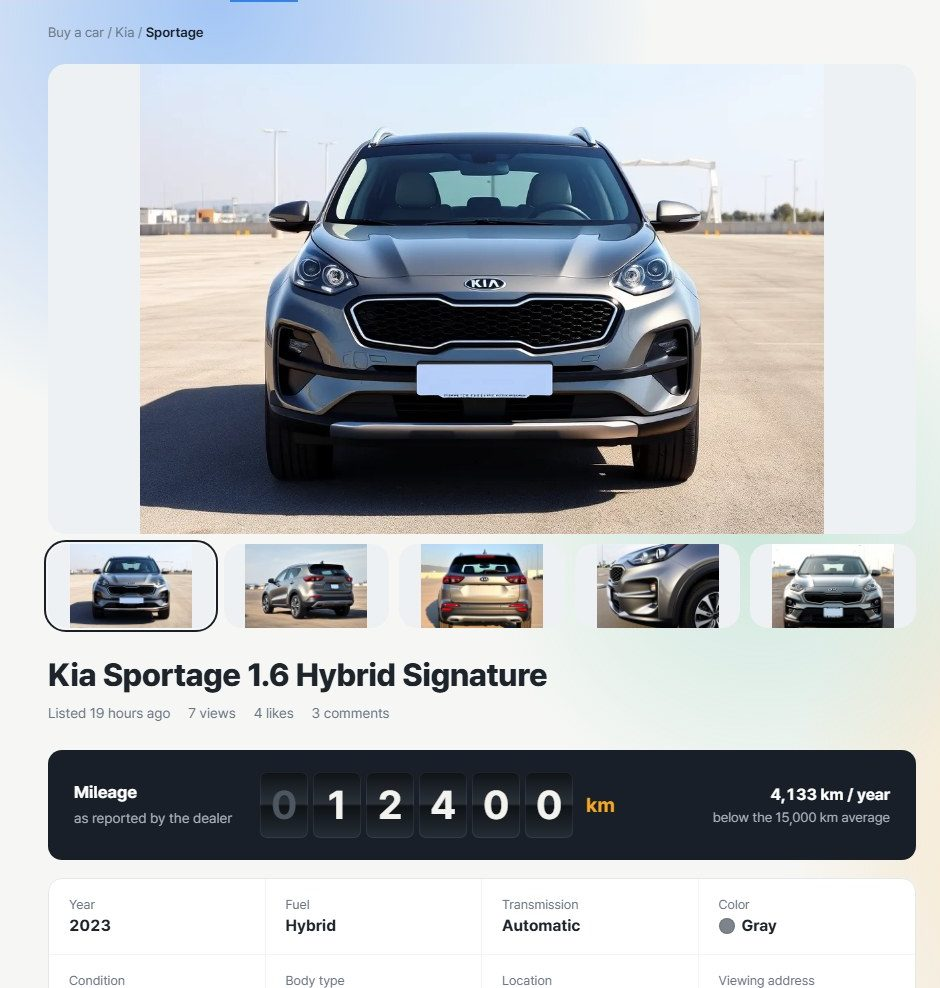
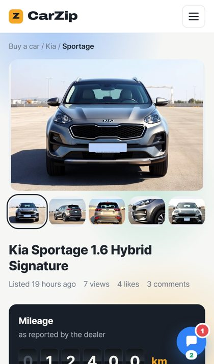
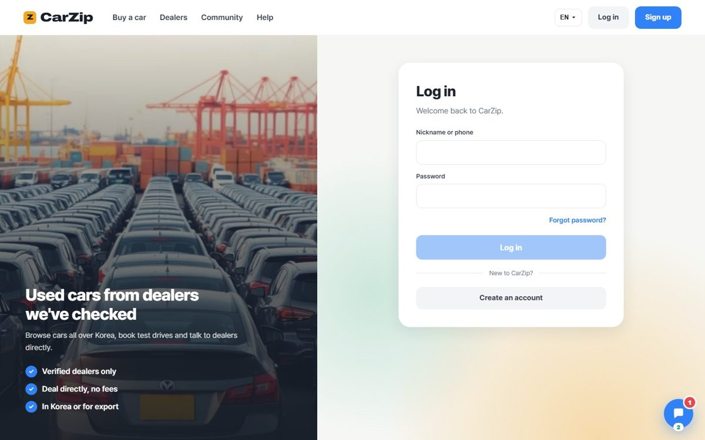
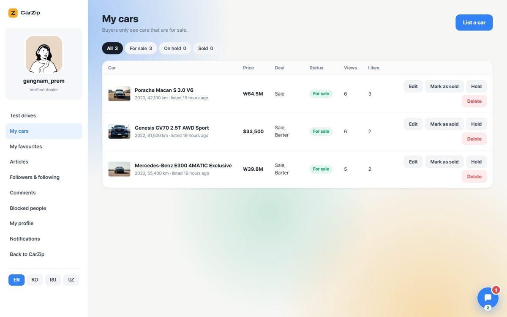
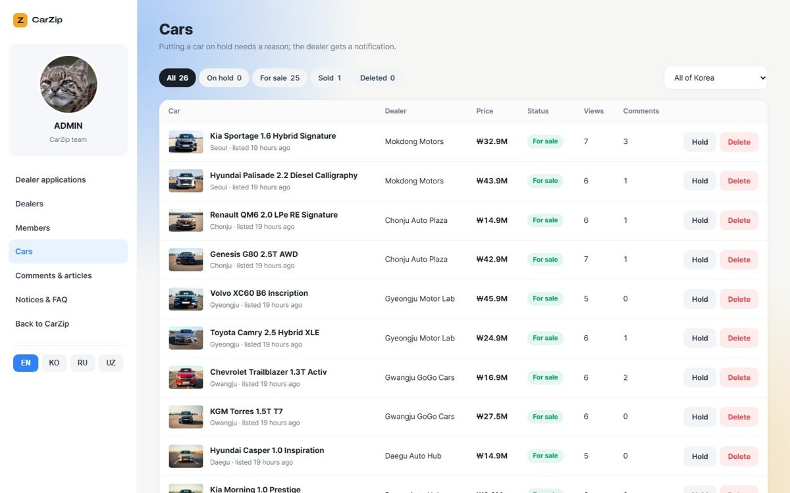

# CarZip — website

**CarZip** is a used-car marketplace for Korea where every dealer is checked before they can list a car.
Buyers search, like, comment, follow dealers and book test drives; dealers manage their cars and answer requests;
admins approve dealers and moderate content. This repository is the **web frontend**; the API lives in
[CarZip (backend)](https://github.com/sanchezSanjar/CarZip).

<p>
	
	
</p>

## Features

**For buyers**
- Car search with filters (brand → model, price in KRW or USD, year, mileage, fuel, options, city …) and sorting.
  The whole search lives in the address, so reload, Back and shared links keep it.
- Car page with a 5-photo gallery and magnifier, a rolling odometer, dealer contacts (call, KakaoTalk, Telegram,
  WhatsApp, email), Naver / Kakao map links, comments and test-drive booking.
- Likes, favourites, recently viewed, following dealers, notifications and a list of your own comments.

**For dealers**
- List and edit cars (photo upload, export price and agreement, rent, barter, test drives), mark sold, pause, confirm
  "still for sale".
- Test-drive inbox (confirm, decline, complete — the buyer's phone is shown only after confirming), comments on
  their cars and articles, followers, and a personal block list.
- Community articles with photos.

**For admins**
- Dealer applications (approve / decline with a reason), dealers and members, cars, comments and articles,
  notices / FAQ / terms.

**Everywhere**
- **4 languages:** English, Korean, Russian and Uzbek, including prices, dates and the API's error messages.
- **Live chat** over WebSocket: guests read, members write; the history survives server restarts.
- Clean, responsive design for desktop and phone, with small motion details (sliders, scroll fade-in,
  counting stats) that respect "reduce motion".

<p>
	
	
</p>
<p>
	
</p>

## Tech stack

| Area | Used |
| --- | --- |
| Framework | Next.js 16 (Pages Router), React 19, TypeScript |
| Data | Apollo Client 4 (GraphQL), plain WebSocket for the live chat, REST for photo uploads |
| UI | SCSS, MUI 9 (menus), SweetAlert2 (dialogs) |
| Languages | next-i18next (en, kr, ru, uz) |
| Backend | NestJS + GraphQL + MongoDB — see the [backend repository](https://github.com/sanchezSanjar/CarZip) |

## Getting started

1. Start the backend first (it runs on port 3007): see the [backend README](https://github.com/sanchezSanjar/CarZip#readme).
2. Create `.env.local` in this folder:

   ```env
   NEXT_PUBLIC_API_URL=http://localhost:3007
   NEXT_PUBLIC_WS_URL=ws://localhost:3007
   ```

3. Install and run:

   ```bash
   npm install
   npm run dev      # http://localhost:3000
   ```

| Script | What it does |
| --- | --- |
| `npm run dev` | development server with live reload |
| `npm run build` | production build (type check included) |
| `npm run start` | serve the production build |
| `npm run lint` | ESLint |

## Project structure

```
apollo/        Apollo Client setup, GraphQL queries and mutations, shared reactive state, chat connection
libs/          components, hooks, types, enums, helpers (auth, uploads, formatting, translations of API messages)
pages/         routes: /, /car, /agent, /community, /cs, /account/join, /mypage, /_admin
public/        images, fonts, translation files (public/locales/<language>/common.json)
scss/          styles: base, desktop, phone, theme and chat
```

## Deployment

The site and the API run on one Ubuntu server with PM2 and nginx (free HTTPS with Let's Encrypt).
The step-by-step guide is in the backend repository: [`deploy/DEPLOY.md`](https://github.com/sanchezSanjar/CarZip/blob/develop/deploy/DEPLOY.md).

## About the demo data

This is a portfolio project. All dealers, buyers, phone numbers and listings are fictional, and the car and article
photos are AI-generated.
